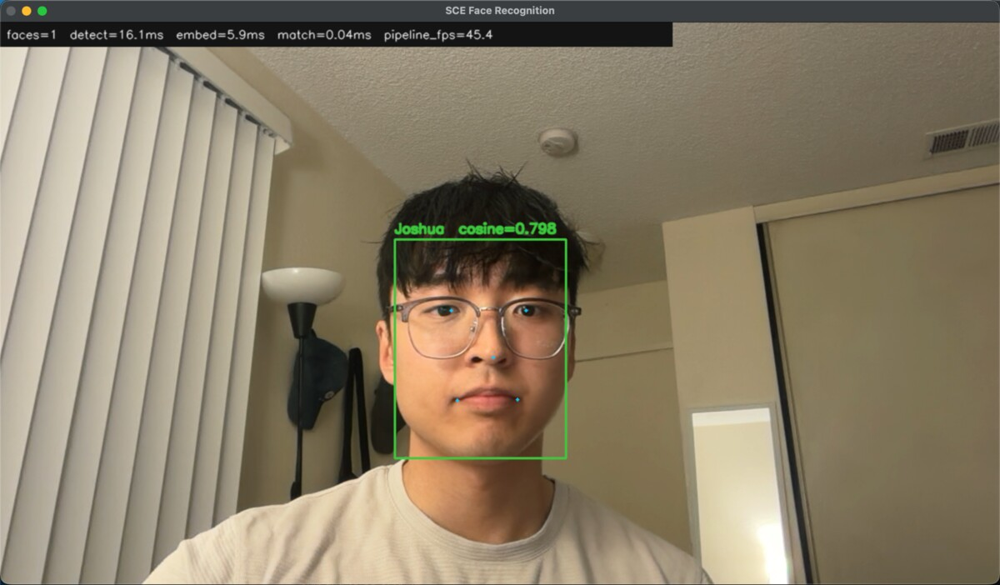

# SCE Face Recognition Pipeline

I built this for the SCE AI x FPGA take-home project. It is a local face
recognition pipeline that works with either saved photos or my MacBook webcam.
The main goal was to understand each part of the pipeline instead of hiding the
whole process behind one library call.

The program can:

- Enroll a person from several photos
- Detect faces from a photo or live webcam feed
- Recognize an enrolled person
- Label someone who was not enrolled as `Unknown`
- Show the similarity score and processing speed
- Run a small benchmark for each stage

Everything runs locally. The face photos, saved face embeddings, downloaded
models, and generated outputs are ignored by Git.

## Live demo



Live webcam test on my M4 MacBook. YuNet detected the face, SFace generated
the embedding, and cosine matching identified the enrolled profile.

## Setup

I tested this on a 2024 MacBook Pro with an M4 chip and 16 GB of RAM.

Clone the repository and enter the project folder:

```bash
git clone https://github.com/joshuajyi/sce-face-recognition-pipeline.git
cd sce-face-recognition-pipeline
```

Install `uv` if it is not already installed:

```bash
curl -LsSf https://astral.sh/uv/install.sh | sh
```

Close and reopen the terminal after installing it. Then install the project
dependencies:

```bash
uv sync --dev
```

Download the YuNet and SFace model files:

```bash
uv run sce-face download-models
```

The download command also checks the SHA-256 hash of each model. This makes
sure the files match the versions I used.

Run the tests and linter:

```bash
uv run pytest
uv run ruff check .
```

The current test suite has 10 tests for embedding normalization, cosine
similarity, gallery storage, nearest-profile matching, and `Unknown` rejection.

## Prepare the photos

Create local folders for enrollment and testing:

```bash
mkdir -p private_photos/enroll private_photos/test
```

I used six enrollment photos of myself. I included straight-on photos, small
left and right head turns, different lighting, and photos both with and without
glasses.

Put the enrollment photos in `private_photos/enroll/`. Keep at least one new
photo for testing and place it in `private_photos/test/`. The test photo should
not be one of the photos used during enrollment.

JPG and PNG files work best. I also found that my original 1536 x 2048 phone
photos were too large for reliable detection. Resizing them to 600 x 800 fixed
the issue in my test.

## Enroll a person

This command enrolls every JPG inside the enrollment folder:

```bash
uv run sce-face enroll "Joshua" private_photos/enroll/*.jpg
```

The program detects the largest face in each photo, aligns it, creates an
embedding, and averages the embeddings into one saved profile.

Check the saved profiles with:

```bash
uv run sce-face profiles
```

Running enrollment again with the same name replaces that person's previous
profile. The saved gallery is stored in `data/gallery.npz` and is not uploaded
to GitHub.

## Test a saved photo

Test a different photo of the enrolled person:

```bash
uv run sce-face recognize \
  --image private_photos/test/joshua_test.jpg \
  --show
```

Test someone who was not enrolled:

```bash
uv run sce-face recognize \
  --image private_photos/test/unknown_test.jpg \
  --show
```

The first photo should display `Joshua`. The second should display `Unknown`.
Annotated copies are saved in `outputs/`.

## Run the live webcam

```bash
uv run sce-face recognize --camera 0
```

The webcam window shows the face box, five landmarks, predicted name, cosine
score, stage timing, and estimated pipeline FPS. Press `q` or Escape to close
the window.

If the camera does not open, allow camera access for Zed or Terminal under
**System Settings > Privacy & Security > Camera**.

## Run the benchmark

```bash
uv run sce-face benchmark \
  private_photos/test/joshua_test.jpg \
  private_photos/test/unknown_test.jpg \
  --repeat 10
```

The full benchmark is saved to `outputs/benchmark.json`.

## How the pipeline works

1. **Detection:** YuNet finds each face and returns a box, five facial
   landmarks, and a confidence score.
2. **Alignment:** The landmarks are used to align and crop the face before
   recognition.
3. **Embedding:** SFace converts the aligned face into a numeric vector.
4. **Enrollment:** The vectors from several reference photos are normalized
   and averaged into one profile.
5. **Matching:** A new vector is compared with every saved profile using cosine
   similarity.
6. **Decision:** The closest match is accepted only if it passes the threshold.
   Otherwise, the face is labeled `Unknown`.

The default cosine threshold is `0.363`, which comes from OpenCV's SFace
example. Raising the threshold makes the program stricter. That can reduce
false matches, but it can also reject the correct person more often.

## Tools I used and why

- **Python 3.11:** Main programming language. It works well with OpenCV and let
  me test each part of the pipeline separately.
- **OpenCV:** Opens the webcam and photos, runs both neural network models, and
  draws the boxes, landmarks, labels, and timing information.
- **YuNet:** Detects each face and returns five facial landmarks. I use those
  landmarks to align the face before recognition.
- **SFace:** Turns an aligned face into an embedding that can be compared with
  saved profiles.
- **ONNX:** The downloaded YuNet and SFace models use this format. OpenCV can
  run them locally without a separate cloud API.
- **NumPy:** Handles normalization, cosine similarity, averaging enrollment
  embeddings, and saving the local gallery.
- **uv:** Installs Python and project dependencies from the committed lockfile,
  so another person can recreate the same environment.
- **pytest:** Tests the embedding math and gallery behavior without needing my
  private photos or webcam.
- **Ruff:** Checks the Python files for formatting and common mistakes.
- **Zed:** My code editor. I chose it because it runs well on my M4 MacBook and
  has a built-in terminal and Git panel.
- **Git and GitHub:** Git records the project in separate stages, while GitHub
  gives reviewers one public place to read and clone it. `.gitignore` prevents
  my photos, embeddings, model files, and generated outputs from being pushed.

I considered DeepFace, but it combines most of these stages behind one
interface. That would have been faster to set up, but I would have had less
control over the individual steps. I also looked at InsightFace, but YuNet and
SFace were smaller and were enough for this laptop prototype.

## Git and development workflow

I kept the Git history separated by what changed instead of uploading the
whole project in one commit. The history shows the project moving from the
initial scope, to embedding storage and matching, then model inference, CLI
commands, dependency locking, tests, and finally the measured results. I used
`git status` and `git diff` before commits to make sure private test data was
not included.

The repository uses `main` as its default branch. A new computer can clone the
repository, run `uv sync --dev`, download the two models, and use the same CLI
commands shown above.

## Results on my MacBook

I enrolled one profile from six photos. I tested one separate photo of myself
and one consenting person who was not enrolled. The benchmark processed both
test photos 10 times each, giving 20 measured runs.

| Measurement | Result |
|---|---:|
| Computer | 2024 MacBook Pro, M4, 16 GB RAM |
| Test image size | 600 x 800 |
| Detection median | 4.75 ms |
| Embedding median | 5.67 ms |
| End-to-end median | 10.58 ms |
| End-to-end p95 | 13.48 ms |
| Pipeline FPS from median | 94.55 FPS |
| Known test photos accepted | 1/1 |
| Unknown test photos rejected | 1/1 |

This was a small personal test, not a full accuracy study. The benchmark FPS
comes from the two saved test photos, so it should not be treated as an exact
webcam frame rate.

## A problem I ran into

One issue I ran into was that YuNet would not detect my face in the
original phone photos, even though the photos looked fine. The originals were
1536 x 2048. After resizing them to 600 x 800, the same photos worked. That
showed me that image preprocessing can affect the result even when the model
and code stay the same.

## Project structure

```text
src/face_pipeline/
  cli.py          Command-line commands
  config.py       Default paths and thresholds
  download.py     Model downloads and checksum verification
  gallery.py      Enrollment storage and profile matching
  matching.py     Normalization and cosine similarity
  pipeline.py     End-to-end processing, timing, and drawing
  vision.py       YuNet and SFace wrappers
tests/             Unit tests for matching and gallery behavior
docs/              Live demo image
```

## AI use

The assignment encouraged using AI during development. I mainly used
ChatGPT/Codex to help generate early versions of the Python code and debug
errors while I was setting everything up. I ran the commands and tests locally,
checked the results with my own photos, and made sure I understood how data
moves through each stage. The actual detection and recognition run locally and
do not use an online face-recognition API.

## Limitations and privacy

- This test only used one enrolled person and two test photos.
- Lighting, head angle, blur, glasses, and distance can change the score.
- The threshold was not calibrated on a large dataset.
- There is no liveness detection, so a photo shown to the camera may fool it.
- The gallery uses a linear search and is only intended for a small number of
  profiles.
- Face photos and embeddings are sensitive data. The program does not upload
  them, and Git excludes them from the repository.

## FPGA connection

This take-home version runs on my laptop. I kept detection, embedding, and
matching separate so the design can be changed later for the Kria K26 project.
Moving a model to the FPGA would still require checking Vitis AI operator
support, quantizing the model, compiling it for the board's DPU, and testing
whether INT8 quantization changes the matching threshold.

## References

- [OpenCV face detection and recognition tutorial](https://docs.opencv.org/5.0/tutorials/dnn/dnn_face/dnn_face.html)
- [YuNet model](https://github.com/opencv/opencv_zoo/tree/main/models/face_detection_yunet)
- [SFace model](https://github.com/opencv/opencv_zoo/tree/main/models/face_recognition_sface)
