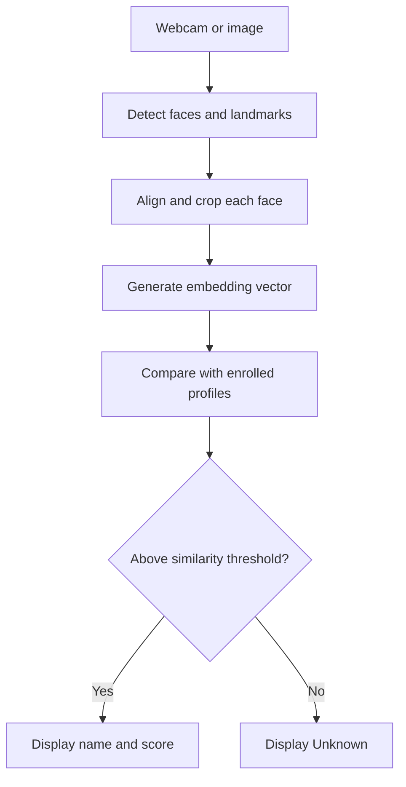

# SCE Face Recognition Pipeline

A local facial-recognition prototype for the SCE AI x FPGA take-home project.
It separates face detection, alignment, embedding generation, and similarity
matching so that each part of the pipeline can be inspected and explained.

## Current status

This repository is being built in small, documented stages. The final pipeline
will support:

- Image and webcam input
- YuNet face detection and facial landmarks
- SFace alignment and embedding generation
- Enrollment from several reference images
- Cosine-similarity matching with an explicit `Unknown` result
- Multiple-face and no-face handling
- Basic latency and FPS measurements

## Planned pipeline

## Scope

The take-home project runs locally on a laptop. It does not attempt to run
Vitis AI on macOS or reproduce the eventual React, FastAPI, Docker, and
Tailscale deployment. The code is structured so those pieces can be discussed
as a future migration path after the laptop pipeline works.

Setup instructions, model choices, measured results, AI usage, and limitations
will be filled in as each stage is implemented and tested.

