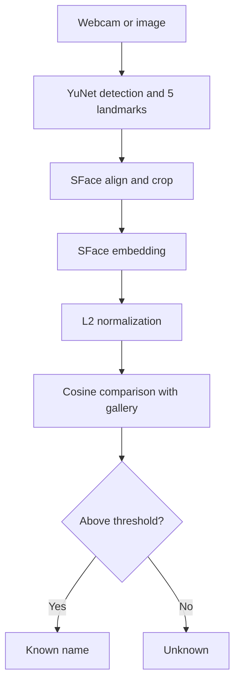

# SCE Face Recognition Pipeline

This is my take-home project for SCE's AI x FPGA team. It runs locally on a
laptop and keeps face detection, alignment, embedding generation, and matching
as separate steps so I can explain the full pipeline.

## 1. Setup and downloads

The tested project version uses Python 3.11, OpenCV, NumPy, YuNet, and SFace.
Run these commands from Terminal on macOS.

### Install `uv`

```bash
curl -LsSf https://astral.sh/uv/install.sh | sh
```

Close and reopen Terminal after the installer finishes. Then enter the project
folder. This example assumes the folder is on the Desktop:

```bash
cd ~/Desktop/sce-face-pipeline
```

### Install the Python dependencies

```bash
uv sync --dev
```

`uv` creates a private `.venv` and installs the exact versions recorded in
`uv.lock`. The virtual environment is excluded from Git.

### Download and verify the two models

```bash
uv run sce-face download-models
```

The command downloads the versioned OpenCV Zoo model files and checks their
SHA-256 hashes. The files are stored in `models/` and are excluded from Git.

### Check the installation

```bash
uv run pytest
uv run ruff check .
```

The current automated test suite contains 10 tests for vector normalization,
cosine similarity, gallery storage, nearest-profile selection, and `Unknown`
rejection.

## 2. Prepare enrollment and test photos

Create private folders that Git will ignore:

```bash
mkdir -p private_photos/enroll private_photos/test
```

Use four or five separate enrollment photos of the same person:

- One straight-on photo
- One looking slightly left
- One looking slightly right
- One in somewhat different lighting
- Optionally, one with glasses if they are normally worn

Each photo should contain one clear face. The face should take up a reasonable
part of the image. Avoid group photos, sunglasses, heavy filters, and blurry
images.

Phone images are fine. AirDrop them to the Mac, convert HEIC images to JPG in
Preview if needed, and copy them into `private_photos/enroll/`. Use simple names
such as `joshua_1.jpg` through `joshua_5.jpg`.

Keep at least one different photo for testing. Do not reuse an enrollment
photo as the only test image. Put test photos in `private_photos/test/`.

## 3. Enroll a profile

Replace the filenames below if yours are different:

```bash
uv run sce-face enroll "Joshua" \
  private_photos/enroll/joshua_1.jpg \
  private_photos/enroll/joshua_2.jpg \
  private_photos/enroll/joshua_3.jpg \
  private_photos/enroll/joshua_4.jpg \
  private_photos/enroll/joshua_5.jpg
```

The program detects the largest face in each image, aligns it, generates a
normalized embedding, averages the reference embeddings, and stores one final
profile in `data/gallery.npz`.

List the enrolled profiles:

```bash
uv run sce-face profiles
```

Delete one profile if needed:

```bash
uv run sce-face profiles --delete "Joshua"
```

Neither the photos nor the generated gallery are committed to Git.

## 4. Test a still image

Test a separate photo of the enrolled person:

```bash
uv run sce-face recognize \
  --image private_photos/test/joshua_test.jpg \
  --show
```

The annotated result is also saved under `outputs/`. Test a consenting person
who was not enrolled:

```bash
uv run sce-face recognize \
  --image private_photos/test/unknown_test.jpg \
  --show
```

The second person should be labeled `Unknown`. The default cosine threshold is
`0.363`, based on OpenCV's published SFace example. It is a starting point, not
a universal value.

To try another threshold without changing the code:

```bash
uv run sce-face recognize \
  --image private_photos/test/joshua_test.jpg \
  --threshold 0.40 \
  --show
```

A higher threshold reduces false accepts but can increase false rejects. A
lower threshold does the opposite.

## 5. Run the live webcam demo

```bash
uv run sce-face recognize --camera 0
```

Press `q` or Escape to stop. The window displays the bounding box, five face
landmarks, predicted name, cosine score, per-stage latency, and pipeline FPS.

If the camera does not open:

1. Open **System Settings > Privacy & Security > Camera**.
2. Allow camera access for Terminal or the editor running the command.
3. Try `--camera 1` if another camera is connected.

## 6. Run a small benchmark

Use photos that were not used for enrollment:

```bash
uv run sce-face benchmark \
  private_photos/test/joshua_test.jpg \
  private_photos/test/unknown_test.jpg \
  --repeat 10
```

The command reports median and p95 latency for detection, embedding, matching,
and the full pipeline. Full system information and model hashes are written to
`outputs/benchmark.json`.

## How the pipeline works



1. **Detection:** YuNet locates every face and returns a bounding box, five
   landmarks, and a confidence score.
2. **Alignment:** The landmarks are used to align and crop the face. This makes
   the next model less sensitive to head rotation and camera angle.
3. **Embedding:** SFace converts the aligned face into a numeric vector.
4. **Enrollment:** Several normalized reference vectors are averaged and
   normalized again to create one profile per person.
5. **Matching:** The query vector is compared with each profile using cosine
   similarity.
6. **Decision:** The closest profile is returned only if its score meets the
   threshold. Otherwise the result is `Unknown`.

## Why I chose these tools

| Choice | Purpose | Reason |
|---|---|---|
| Python 3.11 | Application language | Strong OpenCV support and quick iteration |
| OpenCV | Camera, image handling, and model runtime | Runs the two ONNX models while keeping each pipeline stage visible |
| YuNet | Face detection | Small model with five facial landmarks and an MIT license |
| SFace | Face embeddings | Compact MobileFaceNet-based model with documented alignment and cosine matching |
| NumPy | Vector storage and matching | Makes normalization and cosine comparison explicit and testable |
| `uv` | Environment and dependencies | Creates a repeatable environment from a committed lockfile |
| pytest | Automated checks | Tests matching behavior without needing a camera |
| Ruff | Formatting and linting | One lightweight tool for consistent Python code |

I considered DeepFace because it can produce a result with very little code. I
did not use it as the main implementation because it handles detection,
alignment, representation, and verification behind one interface. Separating
those stages makes it easier for me to understand and explain the pipeline.

I also considered InsightFace. It provides strong detectors and recognition
models, but its bundled pretrained weights are restricted to non-commercial
research use. YuNet and SFace are smaller and have clearer permissive licenses
for this prototype.

## Results to record before submission

Run the commands above on the final MacBook setup and replace the blank values.
Do not copy accuracy numbers from a paper into this table.

| Measurement | Result |
|---|---:|
| Mac model | 2024 MacBook Pro, M4, 16 GB RAM |
| Webcam resolution | 1280 x 720 requested |
| Detection median | _run benchmark_ |
| Embedding median | _run benchmark_ |
| End-to-end median | _run benchmark_ |
| End-to-end p95 | _run benchmark_ |
| Pipeline FPS | _run benchmark_ |
| Known test photos accepted | _record result_ |
| Unknown test photos rejected | _record result_ |

This is a small personal test, not a representative accuracy evaluation.

## Repository structure

```text
src/face_pipeline/
  cli.py          Commands and user interaction
  config.py       Default paths and thresholds
  download.py     Versioned model downloads and checksum checks
  gallery.py      Enrollment storage and nearest-profile search
  matching.py     L2 normalization and cosine similarity
  pipeline.py     End-to-end timing and annotated output
  vision.py       YuNet and SFace wrappers
tests/             Matching and gallery unit tests
docs/              AI usage and evaluation notes
```

## AI-assisted development

AI use is documented in [`docs/AI_USAGE.md`](docs/AI_USAGE.md). I used AI for
planning, model comparison, initial code structure, test ideas, debugging, and
documentation review. I checked the model behavior against OpenCV's official
documentation and used automated and manual tests rather than accepting code
only because it was generated.

## Privacy and responsible use

- Face photos and embeddings stay local and are excluded from Git.
- Anyone included in testing should consent.
- Embeddings are still sensitive biometric data even though they are not raw
  photos.
- Profiles can be listed, deleted individually, or cleared.
- This prototype does not include liveness detection. A printed photo or phone
  screen may fool it.
- This is not a production access-control system.

## Relationship to the FPGA project

The laptop version keeps detection, embedding, gallery storage, and matching
separate. In the future SCE system, compatible neural-network inference could
move to the Kria K26 DPU, while profile storage and cosine matching could stay
on the ARM processor or FastAPI server.

An ONNX file is not automatically compatible with Vitis AI. The team would
still need to inspect supported operators, quantize the model, compile it for
the exact DPU configuration, and test whether the threshold changes after INT8
quantization. The Vitis toolchain should be run on a supported x86-64 Linux
host rather than forced onto Apple Silicon macOS.

## Known limitations

- Recognition quality changes with lighting, pose, blur, masks, and occlusion.
- The starting threshold was not trained specifically for this camera or room.
- The gallery uses a linear search, which is appropriate only for a small
  number of profiles.
- There is no face tracking, liveness detection, authentication, or encrypted
  biometric storage.
- The project uses a personal sanity test rather than a large demographic
  evaluation.

## Model sources and licenses

- [OpenCV face detection and recognition tutorial](https://docs.opencv.org/5.0/tutorials/dnn/dnn_face/dnn_face.html)
- [YuNet model and MIT license](https://github.com/opencv/opencv_zoo/tree/main/models/face_detection_yunet)
- [SFace model and Apache 2.0 license](https://github.com/opencv/opencv_zoo/tree/main/models/face_recognition_sface)
- [InsightFace model licensing considered during selection](https://github.com/deepinsight/insightface/blob/master/python-package/docs/model_zoo.md)

